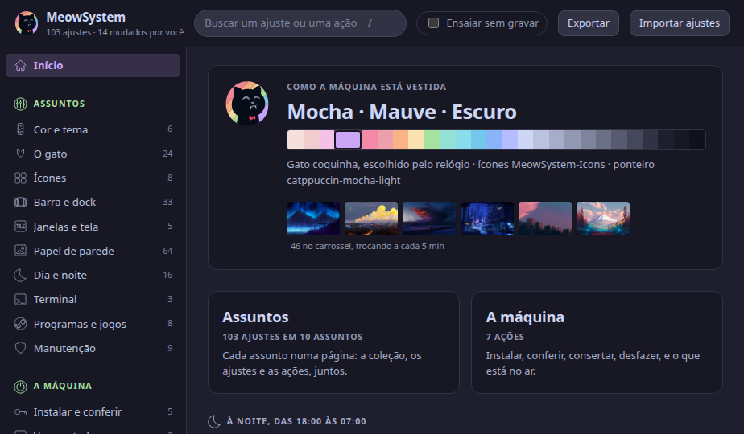
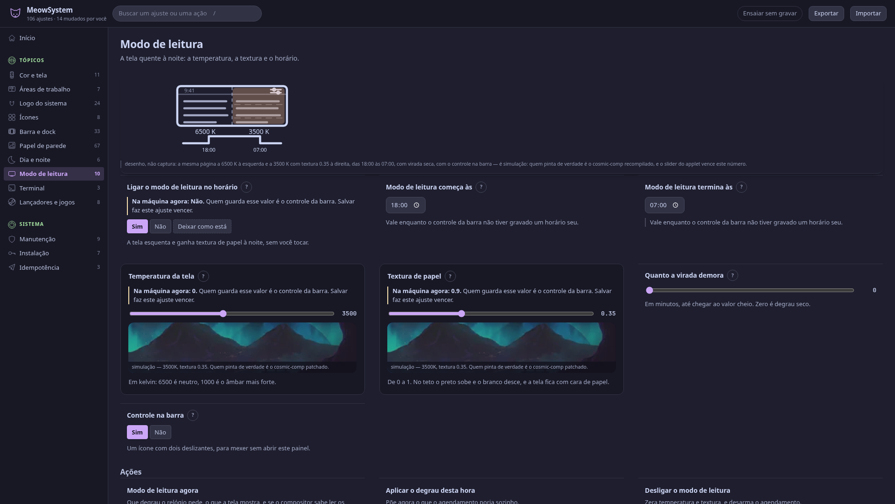
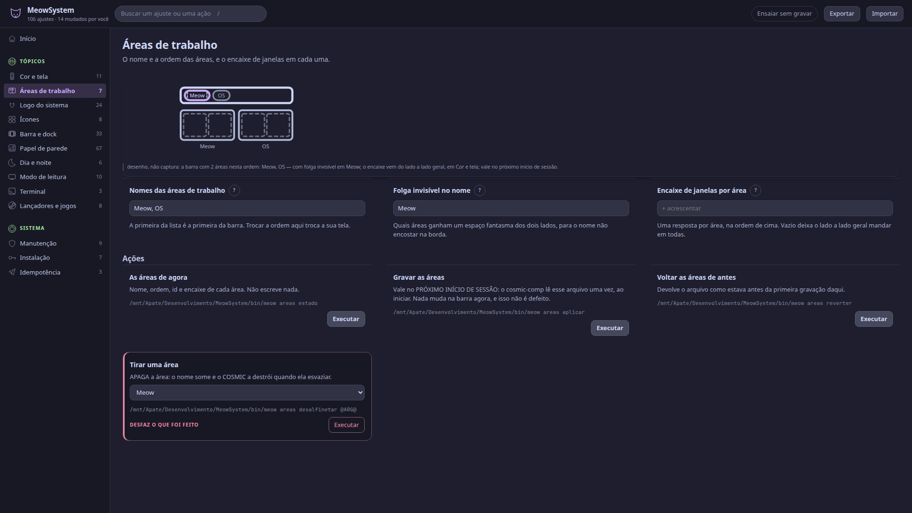
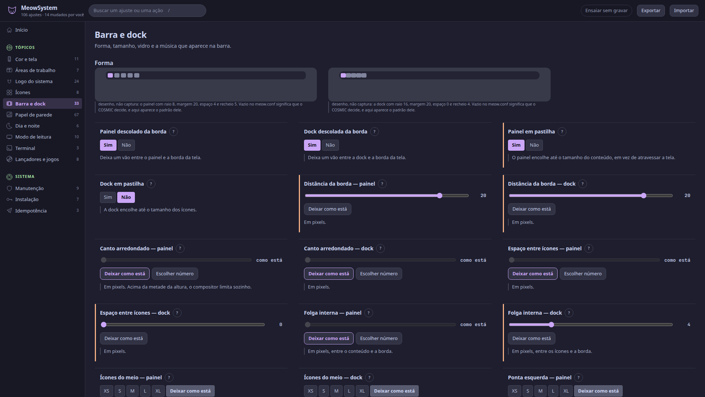
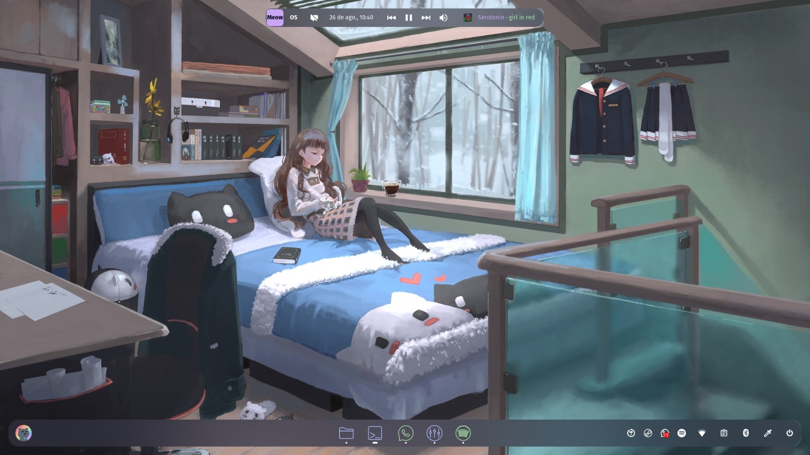
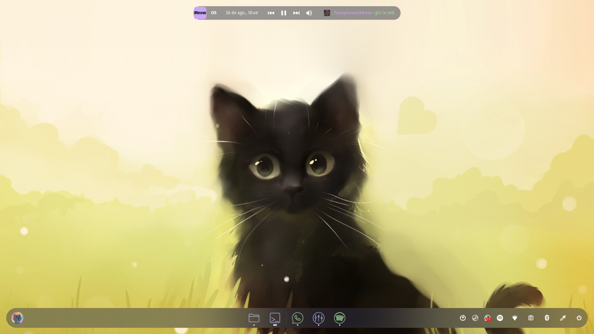
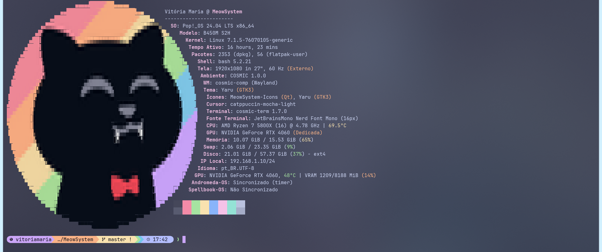
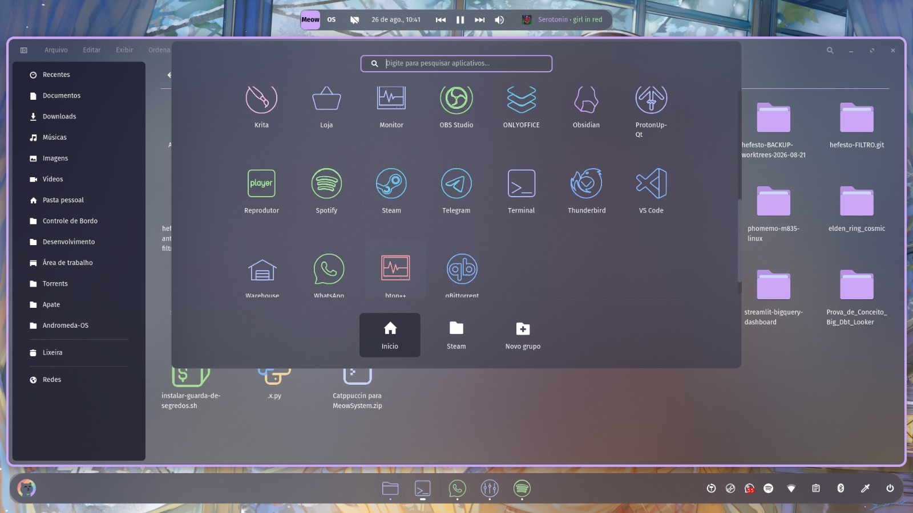

<div align="center">


# MeowSystem

**Catppuccin para o COSMIC, feito para uma máquina só — e documentado o suficiente para virar a sua.**

*Tudo o que ele escreve, ele sabe desfazer — e rodar de novo numa máquina pronta não escreve um byte.*

[](LICENSE)
[](https://github.com/pop-os/cosmic-epoch)
[](install.sh)


[](install.sh)
[](bin/meow)
[](tests/app-navegador.py)

Tema, ícones, barra, dock, terminal e papel de parede do Pop!_OS com COSMIC num instalador só,
e um painel local para mexer em tudo sem abrir um arquivo de texto.



[English](README.en.md) · [Manual completo](docs/) · [Créditos](docs/CREDITOS.md) · GPL-3.0

</div>

---

## Instalar

```bash
git clone https://github.com/[REDACTED]/MeowSystem.git
cd MeowSystem
./install.sh --wizard     # a primeira vez: pergunta quatro coisas e instala
meow ativar               # todas as outras
```

São 54 etapas. Rodar de novo numa máquina já pronta **não escreve um byte** — e diz isso, em vez
de listar as etapas como se as tivesse refeito. Para ver o que aconteceria antes de deixar
acontecer: `MEOW_DRY_RUN=1 ./install.sh`.

## O painel

```bash
meow abrir                # ou o ícone MeowSystem no lançador
```

109 ajustes e 46 ações em treze páginas — uma por assunto, e cada uma com tudo o que existe
sobre ele. O menu tem dois blocos: **Tópicos**, que é a sua tela, e **Sistema**, que é o que a
máquina faz sozinha.

### Cada bloco vem com um desenho, e o desenho é o controle



Nenhum controle aqui explica o que faz só com palavras. Cada bloco abre com um SVG que responde
à pergunta "o que isto faz com a minha tela?", desenhado a partir dos seus valores de verdade —
e ele **repinta enquanto você arrasta o deslizante**, antes de soltar.

Quando há uma escolha esperando, o desenho vira dois: **Como está** e **Como fica**, lado a
lado, com borda de botão. Apertar "Como está" desfaz aquele bloco e só aquele. O desenho fica
preso no alto da página enquanto você rola, para continuar servindo de referência.

O desenho nunca é captura de tela: cada um diz, na legenda, quais números foram desenhados.

### O que dá para fazer aqui



- **Papel de parede** — a coleção de 43 imagens, os 9 ajustes e as 13 ações, na mesma tela.
  Soltar um arquivo aqui diz na hora se ele entrou no grupo de dia ou no de noite, e por quê —
  e dá para discordar: **Dia** e **Noite** mandam a imagem para o lado que você quiser, e
  **Medir** devolve a decisão à luminância.
- **Áreas de trabalho** — o nome e a **ordem** das suas áreas, a folga invisível no nome, e o
  encaixe de janelas de cada uma. Até aqui, a única forma era editar RON na mão.
- **Ícones** — um ícone por programa instalado, trocável um a um, e o tema que o projeto constrói.
- **Modo de leitura** — a tela quente da noite ganhou página própria: temperatura, textura,
  horário e a rampa da virada.
- **Instalar sem sair do painel** — um `.zip` de tema de ponteiro, uma fonte `.ttf`, um tema de
  ícones de base, um gato novo, um papel de parede. O arquivo enviado nunca toca o repositório:
  quem instala é o mesmo comando que você rodaria no terminal.
- E **Cor e tela**, **Logo do sistema**, **Painel e dock**, **Dia e noite**, **Terminal**,
  **Lançadores e jogos**, **Manutenção**, **Instalação** e **Atualização** — esta última com
  `apt`, `flatpak` e `cargo` numa tela e, logo depois, o `doctor` dizendo o que a atualização
  desfez. É a metade que um `full-upgrade` na mão não tem.

Toda variável que o instalador lê tem um controle aqui — e um teste cobra isso, para que uma
chave nova não nasça invisível.

Clicar não muda a máquina: as escolhas se acumulam e um botão só grava e aplica. O botão
**Ensaiar sem gravar** acende em amarelo enquanto estiver ligado, e com ele cada "Executar"
mostra o que aconteceria sem escrever nada.



## O que ele veste

| | |
|---|---|
| **O tema do COSMIC** | As quatro árvores, aplicadas por cópia de arquivo. Claro e escuro são o mesmo tema com um interruptor, então trocar não pisca a interface. |
| **A tela de login** | O `cosmic-greeter` tem configuração própria e vinha vazia: era a única superfície ainda de fábrica. |
| **Painel e dock** | Forma, raio, margem, espaço e recheio de cada segmento; o vidro que sobrevive à janela maximizada; os segundos no relógio; e a música tocando ao lado dele, com capa e controles. |
| **As áreas de trabalho** | Nome, ordem e encaixe de cada uma. A ordem da lista é a ordem da barra, e é a única forma de decidir qual área nasce primeiro. |
| **Os ícones** | Papirus como base, pastas coloridas pelo accent, e os glifos do Arcticons por programa — trocáveis um a um, pelo painel. |
| **O terminal** | As dezesseis cores, o cursor, o prompt do `starship`, e o gato no lugar do logo do `fastfetch`, redesenhado em caracteres a cada geração. |
| **O papel de parede** | Um carrossel de 43 imagens curadas, com pastas de dia e de noite separadas por luminosidade, avançar e voltar no botão direito, e favoritos. |
| **Dia e noite** | Um horário manda em tudo que pergunta "é noite?": o gato do dock, o do terminal, a imagem de fundo e o modo de leitura — que esquenta a tela e lhe dá textura de papel, em rampa. |
| **Os programas** | Spotify, VS Code e companhia vestidos por dentro; os jogos da Steam com um atalho por jogo no lançador, e o atalho saindo junto com o jogo. |

## A máquina

<table>
<tr>
<td width="50%"></td>
<td width="50%"></td>
</tr>
<tr>
<td></td>
<td></td>
</tr>
</table>

## Conferir e desfazer

```bash
meow doctor                            # 49 conferências. Não escreve nada.
meow doctor --consertar                # aplica só o que estiver fora do lugar
./scripts/aplicar_tema.sh original     # devolve o tema de antes
meow desinstalar                       # tira tema, ícones e agendamentos
```

Cada escrita em arquivo do sistema deixa uma cópia antes, e o instalador **recusa por caminho** —
não por boa intenção — escrever fora dos lugares que ele conhece.

## O que esperar

Este repositório nasceu para uma máquina: **Pop!_OS 24.04 LTS com COSMIC**, `apt`, uma RTX 4060 e
os `.desktop` dos jogos dela. O acoplamento é permitido e está escrito — caminhos absolutos, o uid
do `cosmic-greeter`, a lista de programas que o lançador esconde. O que ele dá em troca é o
inverso do costume: o `--wizard` pergunta só as quatro chaves essenciais, o `doctor` diz o que
está fora do lugar antes de você descobrir na tela, e nada aqui é aplicado sem uma cópia do que
havia antes. Se a sua máquina é parecida, instale. Se não é, leia o `doctor`: ele fala.

## Requisitos

Pop!_OS 24.04 LTS · COSMIC 1.0 · `bash`, `python3` e `apt`. O painel abre no navegador que já
estiver instalado, e só escuta em `127.0.0.1`.

## Créditos

O MeowSystem é uma casca: quase tudo o que aparece na tela foi desenhado por outra pessoa, sob uma
licença que permite isso. Os quatro maiores:

- [Catppuccin](https://github.com/catppuccin/catppuccin) — a paleta (MIT)
- [Arcticons](https://github.com/Donnnno/Arcticons) — os glifos dos programas e do painel (CC BY-SA 4.0)
- [Papirus](https://github.com/PapirusDevelopmentTeam/papirus-icon-theme) — a base de ícones (GPL-3.0)
- [catppuccin/papirus-folders](https://github.com/catppuccin/papirus-folders) — as pastas coloridas, pinado em `f83671d1`

**A lista inteira está em [`docs/CREDITOS.md`](docs/CREDITOS.md)** — os cursores, as fontes, os
papéis de parede, os temas de dentro dos programas, o que foi recusado e por quê, e o que você
precisa fazer se redistribuir alguma coisa daqui.

Licença: GPL-3.0.
